# 论文笔记：ABC: Scalable Behavior Cloning with Open Data, Training, and Evaluation

## 元信息

| 项目 | 内容 |
|------|------|
| 机构 | UC Berkeley / MIT / Amazon FAR / XDOF / Carnegie Mellon University |
| 日期 | 2026-06 |
| 项目主页 | https://abc.bot/ |
| 代码 | https://github.com/amazon-far/abc |
| 数据集 | [HuggingFace XDOF/ABC-130k](https://huggingface.co/datasets/XDOF/ABC-130k) |
| 对比基线 | [[MolmoAct2]] / [[Pi05]] / [[LBM]]（Large Behavior Model） |
| 链接 | [arXiv](https://arxiv.org/abs/2606.27375) / [PDF](https://arxiv.org/pdf/2606.27375) / [Code](https://github.com/amazon-far/abc) |

---

## 一句话总结

> 用一个 8000 美元双臂机器人采集 3500 小时、130K episode 的开源遥操作数据集 ABC-130K，配套训练/仿真/评测全栈基础设施，系统化对比 DiT 与 VLA 的架构设计选择。

---

## 核心贡献

1. **ABC-130K 数据集**：迄今最大的开源遥操作数据集，3,553 小时、134,806 episode、195 个任务，覆盖叠衣服、折纸盒、从钱包抽取信用卡等高难度灵巧操作。
2. **ABC-Models 架构研究**：在统一数据和训练流程下，严格对比 [[Diffusion Transformer (DiT)|DiT]] 的视觉条件机制（AdaLN vs 交叉注意力，CLIP vs DINOv3）与 [[VLA（视觉-语言-动作模型）|VLA]] 的连接器设计（交叉注意力 / FAST 协同训练 / AdaLN），并系统研究 batch size 与训练步数的 compute-scaling 关系。
3. **离线指标可预测性分析**：证明训练损失和验证动作误差与真实世界成功率存在统计显著的负相关，为离线快速迭代提供可靠代理指标。
4. **ABC-Sim 仿真套件**：MuJoCo 复刻的真实机器人环境，配合 Blender 高保真渲染管线，验证仿真与真实表现的强相关性（$r=0.85$–$0.91$）。
5. **新型无额外硬件的 [[HG-DAgger|DAgger]] 干预采集方案**：基于被动 leader 臂的末端位姿增量跟踪实现策略纠正数据采集，使折纸盒任务的平均进度从 24% 提升到 85%。
6. **完整推理优化栈与可复现工程细节**：自研视频数据加载器 `abcdl`、`torch.compile` + CUDA Graph 推理优化，将 ABC-DiT/ABC-VLA 推理频率分别提升到 27.6 Hz / 57.2 Hz。

---

## 问题背景

### 要解决的问题

大规模 [[行为克隆|行为克隆]]（Behavior Cloning, BC）的完整技术栈非常"深"：需要搭建机器人硬件、采集示范数据、构建高效的异构数据训练系统、设计有效的学习方案，并通过 [[HG-DAgger|DAgger]] 等方式进一步微调复杂技能。严格评估设计决策通常需要大规模真实世界评测，代价高昂且后勤复杂，导致机器人操作前沿的进展不透明：工业实验室往往在专有数据集上开发 SOTA 系统，即使公开训练方案，细节也不足以复现或判断哪个设计决策真正驱动了性能。

### 现有方法的局限

- [[DROID]]、[[BridgeData V2|BridgeData-V2]] 提供高质量单臂数据，但任务多为单步抓放；
- [[Open X-Embodiment]] 跨本体聚合数据，但质量参差、动作空间和控制频率元数据混乱；
- [[AgiBot World|AgiBot-World]] 提供 3,000 小时双臂数据，但依赖 3 万美元的昂贵机器人平台；
- 最接近的 [[MolmoAct2]] 仅提供 720 小时双臂 YAM 数据；
- 大规模训练方案（如 [[LBM]]、[[GR00T N1]]、[[Pi05|π0.5]]）的高层设计公开，但精细实现细节很少披露，训练代码基本闭源，社区无法在不重新实现整套深度栈的情况下评估这些设计选择。

### 本文的动机

将上述工作的优势整合：在廉价、双臂、可复现的硬件平台（约 8,000 美元的 YAM 工作站）上，以大规模、高质量、高多样性的方式采集数据，并开源训练基础设施、仿真管线和评测套件，让研究者在平等的基础上共同探索 BC 的最佳实践（"learn the ABCs of Behavior Cloning together as a community"）。

---

## 方法详解

### ABC 技术栈总览

ABC 由四个互补部分组成：

- **ABC-130K**：3.5K 小时真实世界遥操作数据，涵盖 130K 条轨迹、195 个任务。
- **ABC-Models**：[[Diffusion Transformer (DiT)|DiT]] 与 [[VLA（视觉-语言-动作模型）|VLA]] 策略的训练与架构/计算规模消融实验。
- **ABC-Sim**：400 小时仿真遥操作数据，覆盖 20 个任务，用于 sim-to-real 相关性研究。
- **ABC-Eval**：超过 100 小时真实世界策略 rollout 及评分，全部公开发布。

### 模型架构：ABC-DiT

ABC-DiT 是一个 [[Diffusion Transformer (DiT)|扩散变换器]] 策略，研究视觉编码器与条件机制的不同组合：

- **输入**：三路 $224\times 224$ 相机图像（顶部相机 + 两个夹爪相机，非方形图像用 letterbox padding）+ 14 维本体感知关节状态
- **输出**：30 步绝对关节位置目标动作块（[[Action Chunking|Action Chunking]]），状态和动作均做 z-score 归一化
- **Backbone**：32 层、24 个注意力头、隐藏维度 1536（比标准 DiT-XL 更大，以避免容量瓶颈）

比较的三个变体：

1. **CLIP-AdaLN**（受 [[LBM]] 架构启发的基线）：每张图像用 [[CLIP]] ViT-B 独立编码，取 CLS token 拼接为视觉表示；语言指令经 [[CLIP]] 文本编码器嵌入并投影；视觉、语言、本体感知、扩散时间步嵌入拼接成单一条件向量，通过标准 [[AdaLN]] 注入 DiT。
2. **CLIP-Cross-Attention**：用 12 个可学习的 latent query token 对每张图像的视觉 token 序列做交叉注意力池化，在 DiT 每个自注意力层后插入一层[[Cross-Attention|交叉注意力]]层（query 来自噪声动作 token，key/value 来自池化视觉 token），非视觉条件仍走 AdaLN 路径。
3. **DINOv3-Cross-Attention**（最终采用）：与上面相同的交叉注意力架构，但将 [[CLIP]] 图像编码器替换为 [[DINOv3]] ViT-B，因为图文对齐表示未必最适合精细操作所需的空间线索，[[DINOv3]] 的像素对齐表示更优。

最终 **ABC-DiT** 采用 DINOv3 + 池化交叉注意力方案，共 2B 参数。

### 模型架构：ABC-VLA

ABC-VLA 基于 [[Gemma 3]]（4B 参数 VLM，[[SigLIP]] 视觉编码器 + Gemma 语言解码器）搭配小型 [[Diffusion Transformer (DiT)|DiT]] 动作头。实验发现冻结 VLM backbone 效果差，因此用动作预测目标端到端微调 backbone。比较三种代表性连接器：

1. **Cross Attention**：VLM 处理图像/语言/本体感知上下文后提取最后一层 token 特征并投影到 DiT token 维度，作为 DiT 每个块中交叉注意力的 key/value，噪声动作 token 流作为 query；扩散梯度经 DiT 交叉注意力一路回传进 VLM。
2. **Cross Attention + FAST**：在 VLM token 序列中拼接 [[FAST]] 离散化的动作 token，用 next-token-prediction 交叉熵微调 VLM；同时 DiT 交叉注意力到最终层的上下文特征（detach，"绝缘"反向传播），借此用交叉熵梯度替代扩散梯度更新 backbone，性能略超 [[Pi05|π0.5]] 风格的 KV 复用方案。
3. **Adaptive LayerNorm (AdaLN)**（最终采用，借鉴 [[LBM]]-2 方案）：VLM 最后一层特征经[[QK-Norm|QK-Norm]] 的注意力池化模块压缩为 8 个 512 维 token，flatten 后投影产生 DiT 的 AdaLN shift/scale/残差门，动作 token 不直接 attend VLM token。

**方差缩减（Variance Reduction）**：扩散训练损失是对数据样本 $x$、噪声 $\epsilon$、时间步 $\tau$ 的期望。由于 DiT 远小于 VLM（42M vs 4B），可以在一次 VLM 前向中复制 VLM 特征和干净动作 $k$ 次，每份配独立的 $(\epsilon,\tau)$ 采样；反向传播时梯度在条件接口处平均，VLM 反向成本与 $k$ 无关，从而以几乎零额外开销获得严格更低方差的梯度估计（H200 上 $k=1$ 为 1.346 s/step，$k=8$ 为 1.366 s/step）。

最终 **ABC-VLA** 采用 AdaLN 连接器，因为它在聚合进度指标上显著优于另外两种方案（见 Table 1）。

### Compute Scaling：Batch Size 与训练步数

社区对最优 batch size 没有共识（[[OpenVLA]] 用 2048，[[LBM]] 用 2560，[[GR00T N1]] 用 16,384）。本文训练 ABC-DiT 和 ABC-VLA 在 batch size 1536/4608/9216 下的版本，发现：较小 batch size 下 DiT 优于 VLA；batch size 增大到 9216 时 VLA 性能跃升幅度远大于 DiT，并在高 batch size 下反超 DiT 的真实表现，但 DiT 始终更计算高效（flop-efficient）。

### 离线指标与真实表现的相关性

由于真实世界评测无法覆盖所有微小架构/超参决策，论文系统比较了**训练损失**、**验证损失**、**验证动作误差**（10 步扩散、无动作前缀下预测动作块与真实动作块的 L2 距离）与真实成功率/进度的相关性：训练损失和验证动作误差均与真实表现显著负相关，验证动作误差相关性最强；验证损失与真实表现**不显著相关**——训练过程中验证损失先降后升，但真实进度持续提升，说明验证损失不是可靠代理。

### ABC-Sim 仿真套件

在 [[MuJoCo]] 中复刻真实机器人设置，并提供 Blender 高保真重渲染管线（路径追踪）。仿真以 240Hz 运行，视觉观测以 60Hz 发送至 VR 头显（支持 Meta Quest 与 Apple Vision Pro），操作员用一对 [[GELLO]] leader 臂遥操作仿真中的 YAM 臂；为缓解长时间 VR 遥操作的眩晕感，启用穿透渲染让操作员能看到仿真机器人背后的真实世界。释放超过 400 小时仿真 VR 遥操作数据，覆盖 10 个任务。Sim-to-real 相关性评估：选取 ABC-DiT、ABC-VLA 各 4 个 checkpoint，加上混合内部 7K 小时数据训练的 4 个 ABC-DiT checkpoint（共 12 个），在三个真实任务上分别评测仿真和真实表现：严格成功率 $r=0.85$（$p=4.2\times10^{-4}$），任务进度 $r=0.91$（$p=5.0\times10^{-5}$）。

### 下游单任务微调

选取四个高精度灵巧任务（钱包抽信用卡、LEGO 分拣、笔帽插入、瓶盖拧开），对比从零训练 / 在公开 ABC-130K（3,500 小时）预训练后微调 / 在内部 7,000 小时语料预训练后微调三种初始化方式。结果显示预训练数据量越大，下游单任务微调性能越强，且收益尚未饱和。信用卡抽取任务上 ABC-VLA 明显优于 ABC-DiT（其余任务用 ABC-DiT）。

### DAgger 折纸盒案例研究

预训练的 ABC-DiT 在折纸盒这一灵巧长程任务上完全无法成功。论文额外采集 10 小时按照严格 SOP（标准操作流程）收集的"collapsed data"，微调 75k 步、batch size 720 后性能仍仅 24%。关键发现：微调后的策略对任务有良好理解，但主要欠缺中间调整和纠错能力。因此论文转向只采集**恢复行为**的 [[HG-DAgger|DAgger]] 干预数据：rollout 策略，在其陷入困境时人工介入接管，记录整条 rollout（不只是介入部分）。第一轮干预数据占比约 30%，第二轮降至 15%；微调数据在无围栏环境采集（与原始有围栏环境形成分布差异）。每轮 DAgger 后，从上一轮基模型继续训练 75k 步，维持 80:10:10 的数据比例（80% 上一轮数据，10% 当前轮介入数据，10% 当前轮其余 episode 数据）——隐式加权介入数据同时保留整条 rollout 的上下文；单纯用介入数据训练会让策略利用源分布（有围栏）与介入数据（无围栏）之间的虚假相关性，反而损害性能。两轮 DAgger 后平均进度从 24% 提升到 85%（Figure 14）。

### 新型无额外硬件 DAgger 采集方案

大多数遥操作数据用被动 leader 臂采集，无主动力反馈。论文提出在不增加任何硬件的前提下采集干预数据的方法：干预发生时，对 leader 臂和 follower 臂的位姿做正向运动学计算，并在干预过程中持续跟踪 leader 臂位姿；取干预起始位姿与当前 leader 位姿之间的 SE3 增量（delta），再用 follower 末端执行器位姿叠加该增量，通过逆运动学（[[mink]]）求解 follower 关节角。从介入切回策略执行时，用介入期间最后若干个动作作为 [[Real-Time Chunking|RTC]] 前缀进行条件化，使切换更平滑，也帮助操作员在观测本身不足以判断"下一步该做什么"时（如折纸盒中是重试折叠某一侧还是进入下一步），更明确地选定扩散策略的某个具体模式。

### 策略条件化机制（Appendix H）

论文研究了三种推理时塑造策略行为的机制，全部在 t-shirt 折叠任务上评测：

- **Operator-ID 条件化**：将操作员 ID 文本附加到任务提示中训练，推理时可在不过滤数据的情况下选择特定操作员的风格。相比直接过滤数据只用高质量操作员（mean score 3.3，且容易过拟合），条件化在全量数据上训练的同一 checkpoint 上，conditioning 到高质量操作员 Op-0 可达 mean score 4.6（8/10 完成）。
- **动作前缀条件化（[[Real-Time Chunking|RTC]] prefix）**：所有策略都用训练时 [[Real-Time Chunking|Real-Time Chunking]] 训练，每个动作块条件化于最近执行的动作前缀，提升块间运动平滑性，但前缀过长会让策略过拟合于既定轨迹、忽视视觉观测（如机器人抓空瓶子后仍按惯性把"手"伸进垂直轨迹而不重新评估）；缩短前缀长度是缓解该问题的最简单方法。
- **子任务条件化**：多阶段任务中，同一任务提示在不同阶段对应不同的动作分布，单帧视觉观测常无法区分阶段（如半折好的衬衫和叠好的衬衫外观相似）。通过语言暴露当前子任务（用与 SARM 类似架构训练的子任务分类器自动设置），policy 在 5/10 试验中不再出现"重新展平已折好衣物"的失败模式。

---

## 关键公式

### 公式 1: [[Conditional Flow Matching|条件扩散训练损失]]

$$
\nabla \mathcal{L} = \mathbb{E}_{x,\epsilon,\tau}\left[\nabla \ell(x, \epsilon, \tau)\right]
$$

**含义**：扩散训练损失是对数据样本 $x$、噪声 $\epsilon$、扩散时间步 $\tau$ 三个随机变量的期望，这是后续"多次扩散采样（multiple diffusion draws）"方差缩减技巧的优化目标。

**符号说明**：
- $x$：干净动作块数据样本
- $\epsilon$：扩散噪声
- $\tau \sim \mathcal{U}(0,1)$：扩散时间步
- $\ell(x,\epsilon,\tau)$：单次采样的扩散损失

---

## 关键图表

### Figure 1: ABC 总览展示图

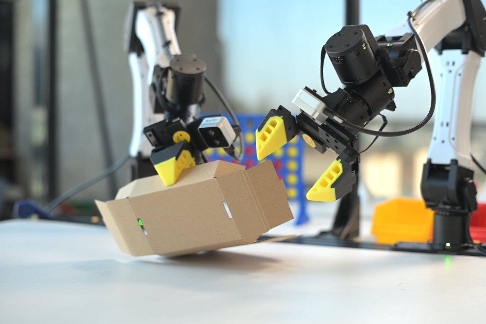

**说明**：ABC-130K 训练出的策略在真实/仿真环境中执行 rollout 的展示拼图，更多视频见 https://abc.bot。

### Figure 2: ABC 技术栈总览

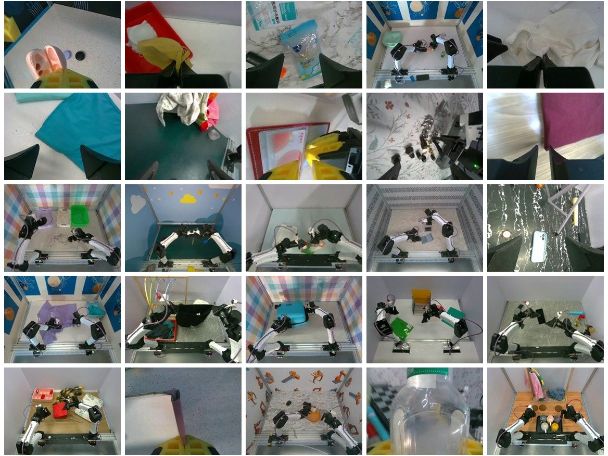
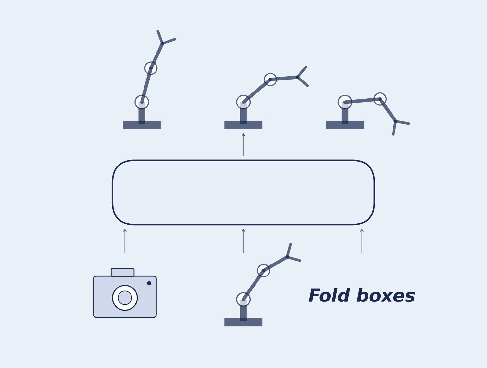
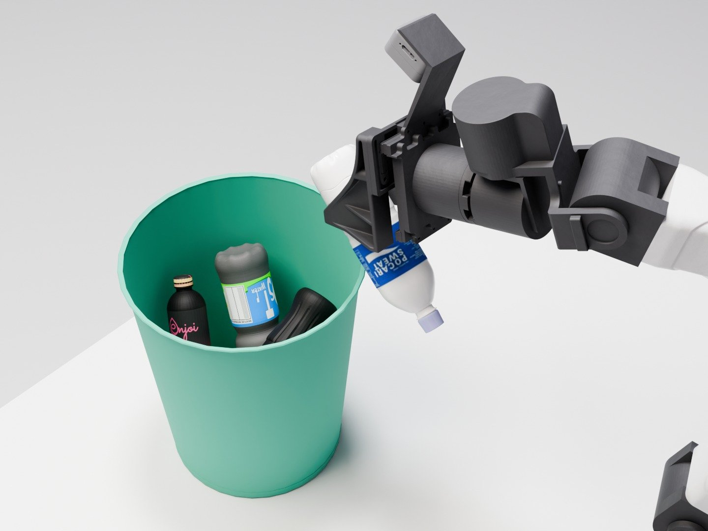
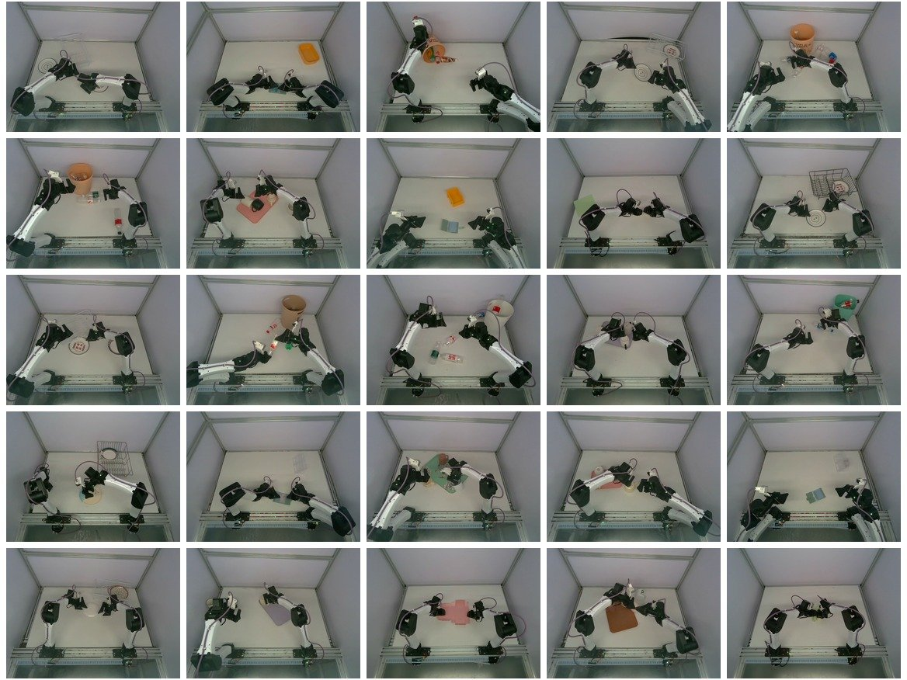

**说明**：ABC 技术栈四大组件——**ABC-130K**（3.5K 小时真实遥操作数据，130K 条轨迹，195 个任务）、**ABC-Models**（DiT 与 VLA 训练，真实世界架构与计算规模消融）、**ABC-Sim**（400 小时仿真遥操作数据，20 个任务，用于 sim-to-real 相关性研究）、**ABC-Eval**（超过 100 小时真实世界 rollout 及评分）。全栈将面向社区开源。

### Figure 3: 数据集总览

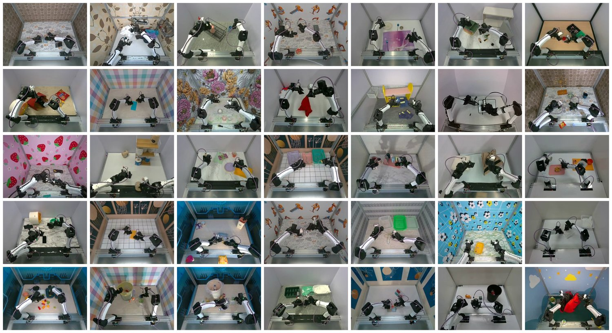

**说明**：ABC-130K 中随机抽取的顶部相机帧样本，展示任务、背景和物体的多样性。

### Figure 4: 各任务类别每任务时长分布

**说明**（原文为对数尺度条形图，未本地化为图片）：7 个原始操作类别按任务数从大到小排列，顶行为 Pick-and-Place（67 任务）与 Fine Pick-and-Place（39 任务），底行为剩余 5 个类别（Folding 36、Insertion/Ejection 19、Tool Use 16、Sorting 8、Tying/Untying 10）。每个类别内按小时数对数尺度降序排列。

### Table 1: 架构消融实验

| Variant | Metric | Pooled adaLN (VLA) | FAST + X-Attn (VLA) | X-Attn (VLA) | DINOv3-xattn (DiT) | CLIP-adaln (DiT) | CLIP-xattn (DiT) |
|---|---|---|---|---|---|---|---|
| Bottles | Strict | 67.3% | 8.0% | 0.0% | 73.5% | 11.8% | 38.9% |
| Bottles | Progress | 83.0% | 44.0% | 5.2% | 93.1% | 53.6% | 74.1% |
| Dishrack | Strict | 30.0% | 2.8% | 0.0% | 23.2% | 28.6% | **34.7%** |
| Dishrack | Progress | 75.7% | 47.2% | 25.0% | 74.1% | 72.3% | **81.3%** |
| Mugs | Strict | 1.0% | 0.0% | 0.0% | 2.0% | 0.0% | 0.0% |
| Mugs | Progress | 25.5% | 6.5% | 5.0% | 35.3% | 15.9% | 21.0% |
| Aggregate | Mean strict | 32.8% | 3.6% | 0.0% | **32.9%** | 13.4% | 24.5% |
| Aggregate | Mean progress | 61.4% | 32.6% | 11.7% | **67.5%** | 47.3% | 58.8% |
| Latency | ms/chunk | 17.24 | 19.24 | 19.24 | 37.4 | 27.5 | 37.5 |

**说明**：200k 训练步后，VLA 和 DiT 架构变体在三个真实任务上的评测结果。Strict success 为任务完成百分比，progress 为平均任务进度，latency 以 10 步扩散下每 chunk 的毫秒数衡量。模型训练于内部 7,000 小时语料。最终 ABC-DiT 选用 DINOv3-xattn，ABC-VLA 选用 Pooled adaLN。

### Figure 5: 训练步数与 Batch Size 对性能的影响

**说明**（原文为散点连线图，未本地化）：DiT 与 VLA 在不同训练 FLOPs（约 1.5K/4.6K/9.2K 有效 batch size，对应不同 checkpoint）下的真实任务严格成功率与任务进度。DiT 始终更 flop 高效；VLA 在高 batch size 下进步更显著并可反超 DiT 的真实表现。

### Figure 6: 多次扩散采样降低 VLA 训练损失

**说明**（原文为训练损失 vs GPU-小时曲线，未本地化）：固定加速器时间下，8 次扩散噪声/时间步采样（8 draws）比单次采样（1 draw）训练损失更低，验证了方差缩减技巧的有效性。

### Figure 7: VLA 训练过程中的离线指标与真实进度

**说明**（原文为训练/验证损失叠加真实进度曲线，未本地化）：训练损失随训练步数持续下降，真实进度同步提升；而验证损失先降后升，但真实进度仍在提升——说明验证损失不是可靠的离线代理指标。

### Figure 8: 离线指标与真实表现相关性

**说明**（原文为散点回归图，未本地化）：训练损失（$r=-0.84$，strict success；$r=-0.78$，progress）与验证动作误差（$r=-0.89$，strict success；$r=-0.85$，progress）均与真实表现显著负相关；验证损失不显著相关（$r=-0.04$ / $r=0.14$）。每个点对应一个 checkpoint，真实成功率在三个评测任务上取平均。

### Figure 9: Sim-to-Real 表现相关性

**说明**（原文为散点回归图，未本地化）：12 个 DiT/VLA checkpoint 上，仿真严格成功率与真实严格成功率相关性 $r=0.85$（$p=4.2\times10^{-4}$），仿真任务进度与真实任务进度相关性 $r=0.91$（$p=5.0\times10^{-5}$）。

### Figure 10: ABC-Sim 任务展示

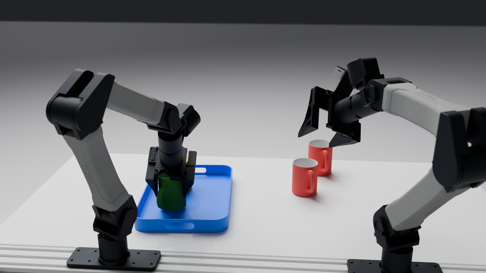
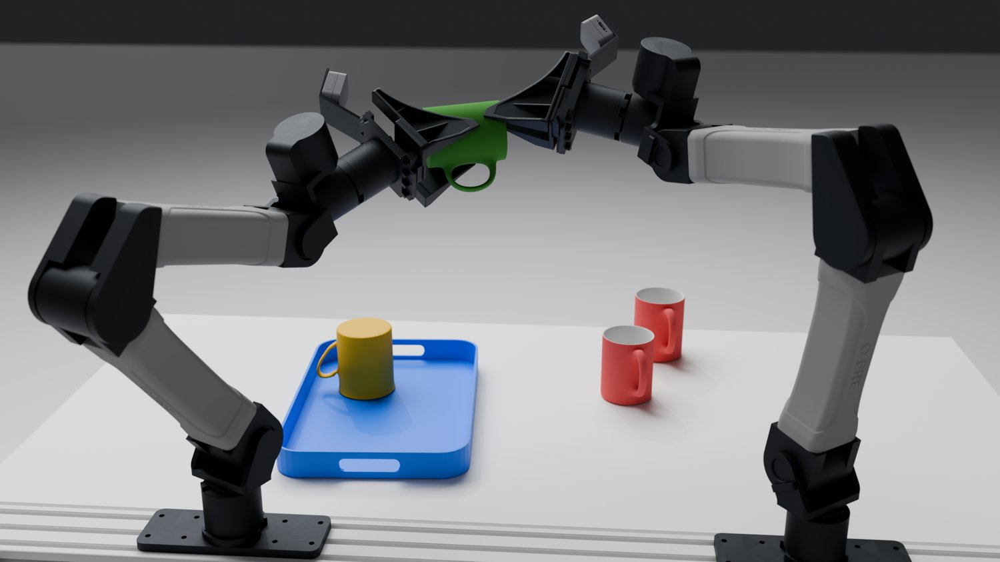
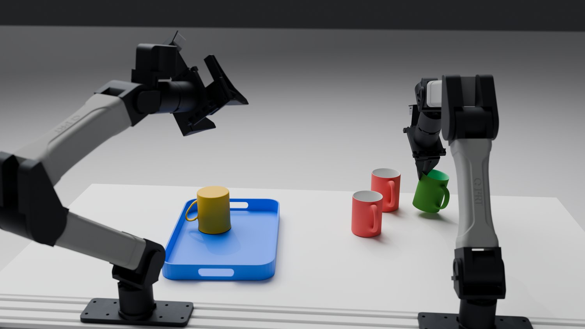

**说明**：[[MuJoCo]] 中构建的仿真任务策略 rollout，展示多阶段"翻转杯子使其正立朝上"任务的三个阶段（抓取、翻转、放置）。默认用 MuJoCo 渲染 rollout，同时提供 Blender 高质量渲染管线。

### Figure 11: ABC-DiT / ABC-VLA 真实世界表现

**说明**（原文为条形图，未本地化）：三个真实任务（Bottles / Dishrack / Mug flip）上 ABC-DiT 与 ABC-VLA 的真实任务进度对比。

### Figure 12: 预训练过程中的仿真进度

**说明**（原文为多子图曲线，未本地化）：ABC-DiT 和 ABC-VLA 在 ABC-130K 上预训练过程中，三个任务（Bottles / Dishrack / Mug flip）的仿真进度随 checkpoint step 的变化曲线，均随训练步数增加而提升。

### Figure 13: 预训练对下游微调的影响

**说明**（原文为分组条形图，未本地化）：四个下游任务（LEGO 分拣、瓶盖拧开、笔帽插入、信用卡抽取）及平均值上，从零训练 / ABC-130K (3.5K h) 预训练后微调 / 内部 7K h 预训练后微调三种初始化方式的平均进度对比，预训练数据量越大效果越好。

### Figure 14: 折纸盒任务上 DAgger 的效果

**说明**（原文为条形对比图，未本地化）：折纸盒任务的微调后平均进度，DAgger 干预前后对比——从约 24% 提升到约 85%。

### Figure 15: 机器人自主折纸盒并合上盒盖

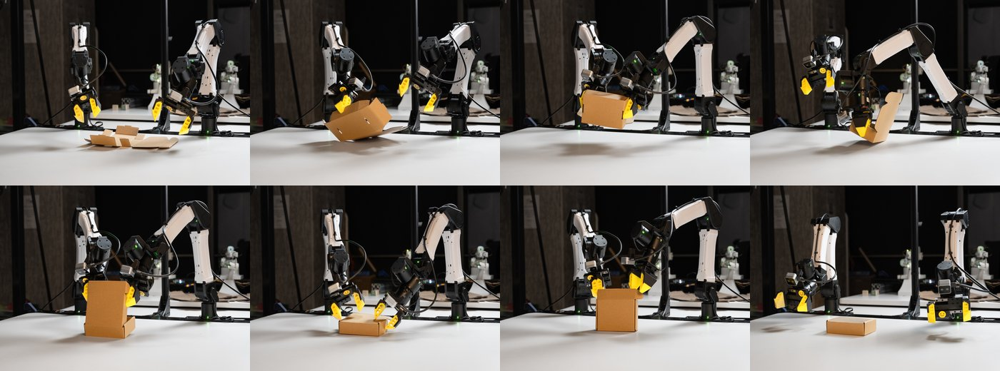

**说明**：机器人自主完成折纸盒并合上盒盖的连续帧展示（图中为代表性帧子集）。DAgger 干预数据对该长程、高精度操作任务的成功至关重要。

### Figure 16: 各任务类别代表性顶部相机帧

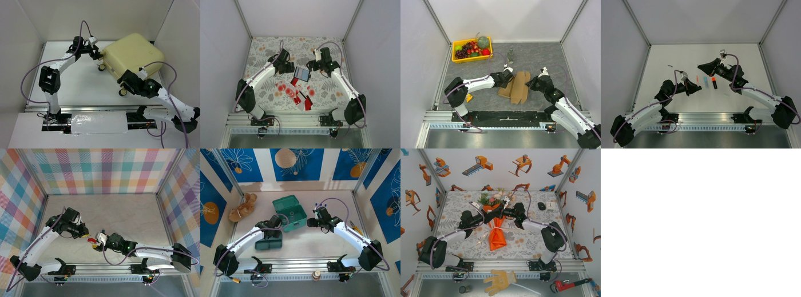

**说明**：7 个任务类别的代表性顶部相机帧示例（图中为代表性子集，原图含全部 24 张：Packing luggage、Place fruits in bag、Organize toys on shelf、Place snacks in bag、Place glasses in tray、Build block tower、Load dishrack、Place coffee filter、Insert credit cards、Set up chess pieces、Fold paper box、Fold skirt pile、Fold t-shirt pile、Roll up utensils、Attach microphone、Cap pens、Lock with key、Seal zip-top bag、Organize lab equipment、Tie flower bouquet 等）。

### Figure 17: 高效帧访问设计（数据加载）

**说明**（原文为字节偏移示意图，未本地化）：更频繁地编码关键帧（keyframe）并使之可被解析重建帧索引，使随机帧访问几近免费。`torchcodec` 默认需要扫描全文件构建帧索引（top），正确编码后可解析式计算索引，只需读取文件头加最近关键帧之后的帧，减小磁盘压力。

### Figure 18: 随机帧解码吞吐量

**说明**（原文为吞吐量 vs dataloader worker 数曲线，未本地化）：固定编码选项（GOP=30 + 固定帧率 CFR）与 dataloader 参数后，每秒解码数随 worker 数增加而显著提升，相比 naive 编码（GOP=250，无 CFR）。

### Figure 19: 单次解码读取数据量

**说明**（原文为对数尺度条形图，未本地化）：CFR 帧映射使平均每次解码所需读取的文件数据量从 9.75 MB 降至 0.14 MB，约 70 倍降低，显著减少带宽受限场景下的数据加载耗时。

### Figure 20: ABC-VLA 池化 AdaLN 架构

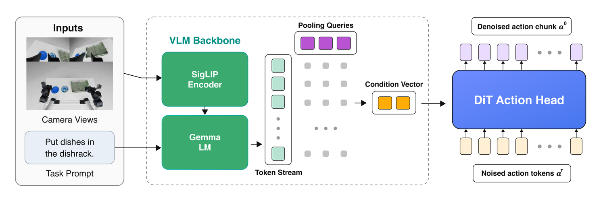

**说明**：ABC-VLA 使用 [[Gemma 3]] VLM backbone，将多路相机视图与任务提示输入 VLM token 流，对最终 VLM 隐状态做注意力池化得到紧凑特征向量，投影为 adaLN 条件向量驱动轻量级 DiT 动作头，输出去噪后的动作块 $a_0$（从噪声动作 token $a_\tau$ 迭代生成）。

### Figure 21: ABC-DiT 模型规模缩放

**说明**（原文为训练损失曲线，未本地化）：四种 ABC-DiT 规模（S/B/L/xL，参数量分别为 153M / 290M / 746M / 1.93B）在相同超参数和全局 batch size（9,216）下，训练损失随优化步数和累计训练算力（EFLOPs）的变化。在固定算力或步数预算下，更大的 DiT 达到更低训练损失。

### Figure 22: 硬件设置

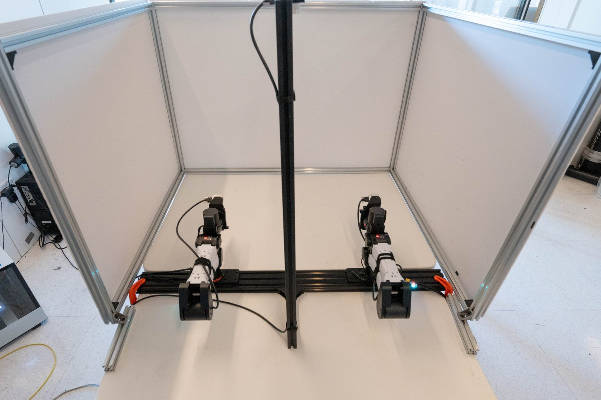
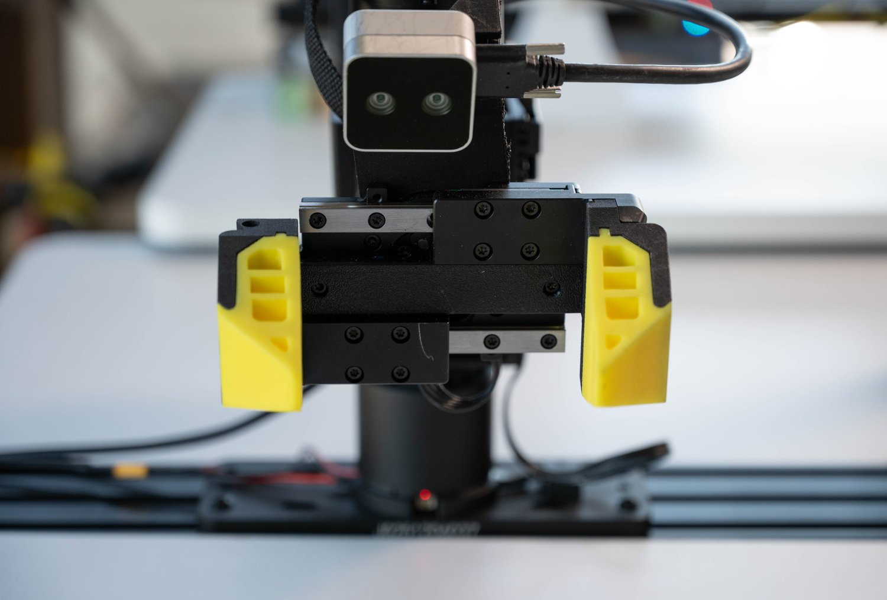
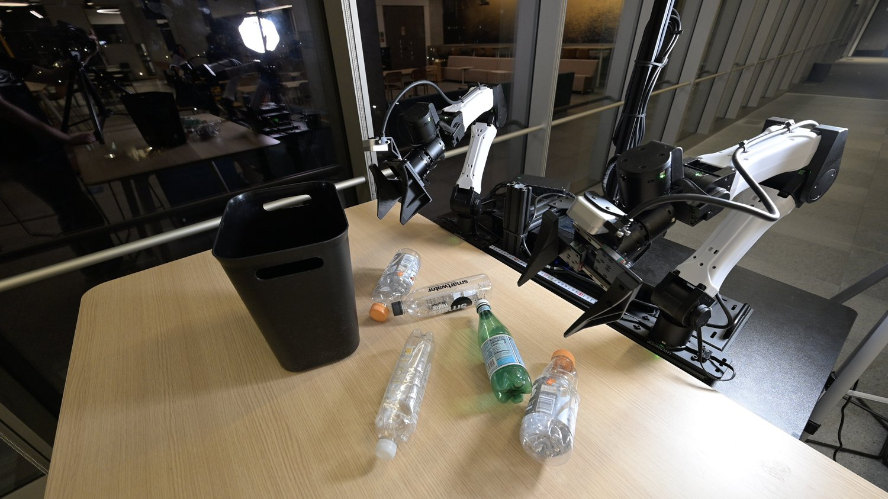

**说明**：(a) 双臂 [[YAM Robot|YAM]] 工作站，配两个 6-DoF 机械臂、三个 RealSense D405 相机和白色围栏；(b) 数据集子集使用的 FlexPoint 夹爪特写；(c) 使用本数据集训练的策略可部署到非围栏的真实场景中。

### Figure 23: ABC-DiT 推理优化

**说明**（原文为推理 trace 时序图，未本地化）：10 步扩散去噪下，ABC-DiT 推理延迟从 Eager 模式 63.0 ms（15.9 Hz，44% GPU 利用率）依次优化到分离编译 47.5 ms（21.0 Hz）、单图编译 + 自动调优 41.3 ms（24.2 Hz）、最终单图编译 + 自动调优 + CUDA Graph 36.3 ms（27.6 Hz，99% GPU 利用率）。所有计时基于 NVIDIA RTX 5090。

### Figure 24: ABC-VLA 推理优化

**说明**（原文为推理 trace 时序图，未本地化）：ABC-VLA 推理延迟从 Eager 47.8 ms（20.9 Hz，59% GPU 利用率）经分离编译 22.6 ms（44.2 Hz）优化到全图编译 17.5 ms（57.2 Hz，94% GPU 利用率）。尽管 ABC-VLA 总参数量是 ABC-DiT 的两倍以上，但因每次扩散步重复计算的部分（45M 动作头）远小于 ABC-DiT 的 1.93B 扩散头，整体推理反而更快。

### Table 2: ABC-DiT 与 ABC-VLA 参数与算力分配

| Model | Backbone Params | Action head Params | Backbone TFLOPs/sample | Action head TFLOPs/sample | Total TFLOPs/sample |
|---|---|---|---|---|---|
| ABC-DiT | 85.7M | 1.93B | 0.329 | 0.349 | 0.678 |
| ABC-VLA | 4.3B | 44.7M | 6.957 | 0.063 | 7.020 |

**说明**：TFLOPs 为每样本训练 TeraFLOPs（用 $3\times$ 前向估计反向+前向，一次乘加计两次 FLOP）。ABC-VLA 每样本用 8 个独立扩散噪声/时间步采样，ABC-DiT 只用单次采样（因为多次采样会重复评估其更大的动作头），ABC-VLA 中昂贵的 VLM 前向在多次采样间共享、只有小动作头被重复计算。ABC-DiT 反常规地把大部分参数放在动作头而非视觉骨干，因为视觉骨干虽参数高效但计算密集（要处理三路相机图像 patch）；ABC-VLA 则反过来把大部分参数和算力放在 Gemma-SigLIP 骨干。

### Table 3: 评测任务评分细则（Rubric）

| Task | Setting | Max Score | Timeout | Scoring Rubric |
|---|---|---|---|---|
| throw plastic bottles in bin | 6 bottles, 1 bin | 6 | 120 s | 每个瓶子进桶 +1 |
| insert pens into the pen caps | 1 pen, 1 cap | 3 | 120 s | 拿起笔和帽 +1；插入笔帽 +2 |
| load plates into tabletop dish rack | 2 plates, 1 dish rack | 6 | 180 s | 每个盘子：拿起 +1，放入 +1，放置正确 +1 |
| sorting legos into containers | 2 green/yellow bricks, 2 bins | 4 | 120 s | 每个正确分拣的 lego +1 |
| unscrew bottle caps | 1 bottle | 3 | 120 s | 拿起瓶子 +1，拧开瓶盖 +2 |
| take credit cards out of the card holder | 1 wallet + cards, 1 container | 5 | 180 s | 打开钱包 +1，取出卡 +1，放入容器 +1（含多张累计） |
| folding paper box | 1 paper box | 5 | 180 s | 拿起盒子 +1，折每一面 +1，合上盒盖 +1，折入翻盖 +1 |
| folding tshirt pile and stacking | 1 t-shirt | 5 | 390 s | 拿放 +1，展平 +1，至少一次正确折叠 +1，完整折叠（近似正方形）+1，放入角落 +1；折叠质量评 低/中/高 |

**说明**：Max Score 为该任务最高可得分，报告的 progress 为实际得分除以最大分；timeout 为最长试验时长。该 rubric 用于全文所有真实世界评测。

### Figure 25: 操作员条件化的影响

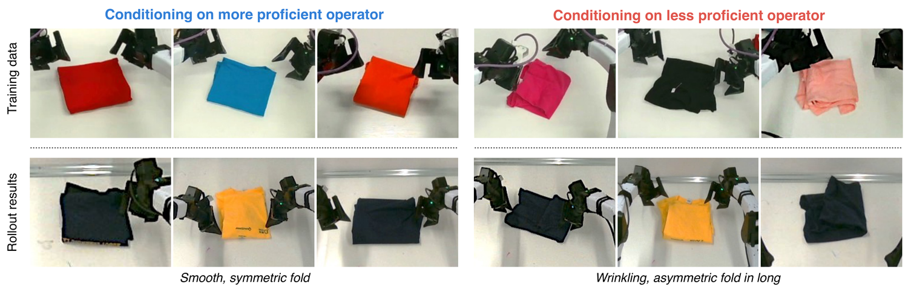

**说明**：上排为训练数据中 Op-0（更熟练操作员，左）与 Op-1（较不熟练操作员，右）贡献的折叠示范；下排为同一训练好的策略在 Op-0（左）/ Op-1（右）条件下的代表性折叠 rollout 结果。尽管策略相同，仅改变操作员提示就能产生与对应操作员训练分布相匹配的、质性不同的折叠结果（Op-0 条件下平滑对称折叠，Op-1 条件下长边出现褶皱、不对称折叠）。

### Table 4: 操作员 ID 条件化对 T-shirt 折叠行为的影响

| Training data | Inference prompt | Mean score | Completions | Mean time | H/M/L |
|---|---|---|---|---|---|
| All-operator corpus | task only | 3.8 | 4/10 | 302 s | 2/2/0 |
| Op-0 filtered corpus | task only | 3.3 | 2/10 | 369 s | 1/0/1 |
| All-operator corpus | task + Op-0 | **4.6** | **8/10** | 237 s | 4/3/1 |
| All-operator corpus | task only (marginalize) | 4.4 | 6/10 | 247 s | 1/4/1 |
| All-operator corpus | task + Op-1 | 4.0 | 5/10 | 277 s | 1/1/3 |

**说明**：评分满分 5；平均时长以分:秒报告，超时按最大时长（390s）计；H/M/L 质量计数仅统计已完成试验。所有条件化行使用同一训练 checkpoint，仅推理时提示不同。条件化到高质量操作员 Op-0 的完成率和评分最高；用过滤数据训练（Op-0 filtered corpus）反而表现更差，说明条件化优于数据过滤。

### Figure 26: 前缀条件化抑制视觉响应性

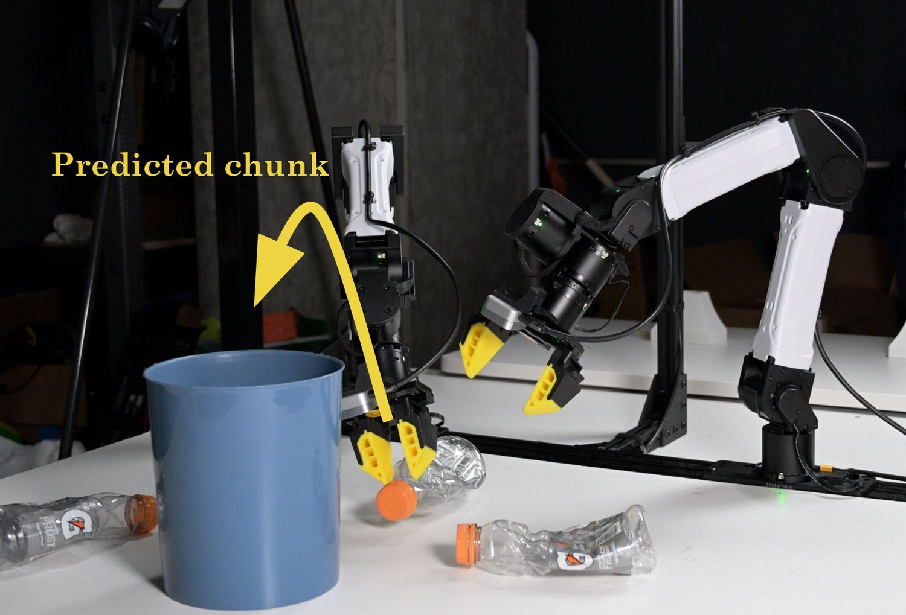
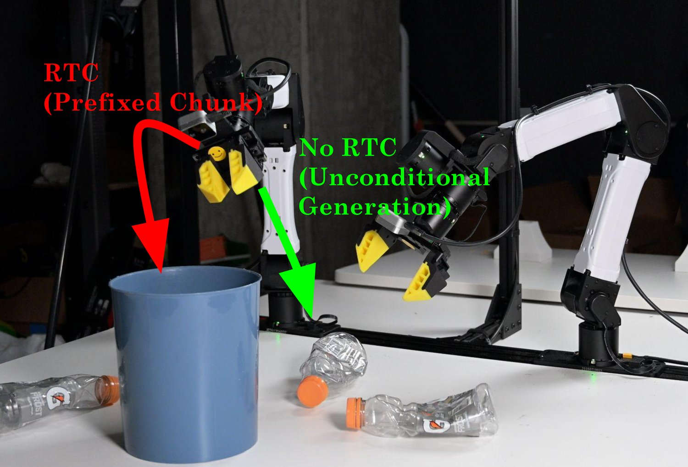

**说明**：基于最近动作的前缀条件化生成可能使生成动作偏向延续既有轨迹。左：第一个动作块中机器人未能抓住瓶子；右：下一个动作块对比 [[Real-Time Chunking|RTC]] 前缀条件化生成与无条件生成——前缀条件化的模型继续把"手"伸向垂直轨迹进入垃圾桶（忽视已经脱靶的视觉观测），而无条件生成尽管欠平滑，但正确响应了视觉观测重新评估抓取。

### Table 5: 动作前缀长度对 T-shirt 折叠表现的影响

| Action prefix | Mean score | Completions | Mean time | H/M/L |
|---|---|---|---|---|
| Prefix = 4 | 3.9 | 5/10 | 309 s | 3/2/0 |
| Prefix = 1 | **4.6** | **8/10** | 237 s | 4/3/1 |

**说明**：在 Op-0 条件化下，使用同一训练 checkpoint，仅改变推理时前缀长度。更短的前缀（1）在评分和完成率上均优于更长前缀（4），表明缩短前缀长度是缓解"前缀过拟合抑制视觉响应"问题的简单有效方法。

### 附录表：ABC-130K 任务分类统计

| 类别 | 任务数 | 总时长 | 典型任务 |
|---|---|---|---|
| Pick-and-Place | 67 | 793 h | 摆杯子配杯垫、把零食放入纸袋、打包书包 |
| Fine Pick-and-Place | 39 | 736 h | 插信用卡、搭积木塔、别/取胸针 |
| Folding | 36 | 883 h | T 恤/长袖/短裤/裙子折叠、折纸盒、折纸飞机 |
| Insertion/Ejection | 19 | 441 h | 插头入插座、笔插笔帽、电池装遥控器、钥匙挂环 |
| Tool Use | 16 | 321 h | 拉夹克拉链、封口袋、用钥匙开锁、用簸箕扫地 |
| Sorting | 8 | 205 h | LEGO 按色分拣、药丸分类、螺丝螺母按类分拣 |
| Tying/Untying | 10 | 175 h | 塑料袋打结、系鞋带、扎花束、耳机线缠绕解绕 |

**说明**：195 个任务按主要接触模式和精度要求归为 7 个原始操作类别，统计已对语法变体（如 "sorting legos into containers" 与 "sort the legos into the containers"）做去重合并。

---

## 实验

### 数据集

| 数据集 | 规模 | 特点 | 用途 |
|--------|------|------|------|
| ABC-130K | 3,553 h / 134,806 episode / 195 任务 | 双臂 YAM 平台，公开遥操作元数据（操作员 ID、时间戳），1,552h 含子任务标注 | 预训练 |
| ABC-Sim | 400 h / 20 任务 | MuJoCo + Blender 高保真渲染，VR 遥操作采集 | sim-to-real 相关性研究、混合训练 |
| 内部语料 | 7,000 h | 开发阶段使用，公开数据集定稿前的内部数据 | 架构消融对比、DAgger 微调基座 |
| T 恤折叠子集 | ~268.64 h | 全部含子任务标注（vs 全集 44%） | 策略条件化研究 |

### 实现细节

- **ABC-DiT**：32 层、24 头、hidden size 1536；学习率 $1\times10^{-4}$（1000 步线性 warmup 后恒定）；[[AdamW]]，weight decay 0.01，视觉编码器学习率缩放 0.1；梯度裁剪 max norm 10；12 个 H200 节点，per-GPU batch 96，全局 batch 9216；本体感知输入以 0.1 概率 dropout。
- **ABC-VLA**：[[Gemma 3]] 4B backbone + [[SigLIP]] 视觉编码器；本体感知经两层 MLP（hidden 256）投影为 2560 维向量接入 token 流；8 个可学习 query token 池化最后一层 Gemma 特征为 8×512 维向量；扩散头 8 层、hidden size 512、8 头；学习率 $1\times10^{-4}$，AdamW，weight decay 0.01，梯度裁剪 max norm 10 / max value 100；bf16 混合精度；8 个 H200 节点，per-GPU batch 24，梯度累积 6，全局 batch 9216。
- **硬件**：全部训练于 NVIDIA H200 GPU；推理延迟测试于 NVIDIA RTX 5090。
- **机器人平台**：两个 [[YAM Robot|I2RT YAM]] 6-DoF 机械臂并排安装，三面白色围栏，三个 Intel RealSense D405 相机（30Hz，一个第三人称俯视 + 两个手腕相机）。
- **真实机器人代码**：基于 [[ZeroMQ]] 的去中心化 PUB/SUB 节点系统（类似 [[ROS]]），各硬件模块独立节点，定频 tick，末 300 微秒用忙等待提升计时精度。
- **数据加载（`abcdl`）**：每个 episode 存为一个 MP4（多路相机堆叠）+ 一个二进制状态-动作文件；H.264 编码，启用 `+faststart`、禁用 B-frame、固定 GOP=30（对应 30fps 视频每秒一个关键帧），从而可解析式重建帧索引，配合 `torchcodec` 的 `VideoDecoder` 实现近乎零开销的随机帧访问；支持本地挂载文件系统与 S3/GCS 远程流式加载。
- **微调超参**（单任务）：AdamW，视觉骨干和动作专家学习率均为 $1\times10^{-5}$，weight decay $1\times10^{-2}$；ABC-DiT batch 1,440，ABC-VLA batch 192，单个 H200 节点；训练 200,000 步，每 50,000 步可视化检查 checkpoint。

### 可视化结果

折纸盒任务的连续帧（Figure 15）展示了机器人自主完成多步骤折叠并合上盒盖的完整流程；操作员条件化实验（Figure 25）直观展示同一策略在不同操作员 prompt 下产生质性不同（平滑对称 vs 褶皱不对称）的折叠结果；前缀条件化实验（Figure 26）展示了 RTC 前缀如何让策略在抓取失败后仍"盲目"延续既定轨迹而忽视视觉反馈。

---

## 批判性思考

### 优点

1. **极致的开放性与可复现性**：数据、训练代码、仿真环境、评测 rollout 全部公开，且公开了大量通常被工业实验室隐藏的精细实现细节（dataloader 编码参数、推理编译优化步骤、具体超参），是当前 BC/VLA 领域罕见的"全栈透明"工作。
2. **严格的受控消融实验**：在固定数据、固定训练流程下单独改变一个变量（视觉编码器、连接器类型、batch size），使得架构比较结论更可信，避免了不同论文之间因数据/超参差异导致的"伪比较"。
3. **离线指标可预测性的系统性验证**：明确指出验证损失不可靠而验证动作误差和训练损失可靠，这一发现对整个领域的实验流程设计有直接指导意义，能大幅降低真实世界评测成本。
4. **务实的工程创新**：无额外硬件的 DAgger 干预采集方案、视频 GOP 编码优化、`torch.compile`+CUDA Graph 推理优化等都是"小而实用"的贡献，直接可被社区复用。
5. **sim-to-real 相关性量化**：给出了具体的 Pearson 相关系数和样本量，而非泛泛宣称"仿真有用"，增强了 ABC-Sim 的可信度。

### 局限性

1. **围栏环境的背景多样性受限**：作者承认数据采集在三面围栏内进行，虽然减少了评测中的视觉干扰方差，但限制了背景泛化的训练信号，尽管声称许多策略可以迁移到非围栏场景，但缺乏系统性的域外（in-the-wild）成功率量化数据。
2. **DAgger 方案依赖人工操作员的实时判断力**：介入时机、介入比例（30%→15%）等高度依赖操作员经验，缺乏自动化的不确定性检测或失败预测机制来触发介入，可复现性存疑（不同团队的操作员介入策略可能差异很大）。
3. **离线指标结论的泛化范围未知**：验证动作误差/训练损失与真实表现的相关性是在同一机器人平台、同一任务集合上得出的，是否能泛化到其他本体、其他任务类型尚未验证。
4. **ABC-VLA 与 ABC-DiT 的比较在不同 batch size 下结论不一致**：低 batch size 下 DiT 更优，高 batch size 下 VLA 反超，这种交叉现象提示读者简单比较"哪个架构更好"可能存在 batch size 混淆变量，论文虽然指出了这一点但未深入解释机制原因。
5. **子任务条件化分类器依赖额外训练**：依赖一个额外训练的子任务分类器（基于 [[SARM]] 架构），增加了部署复杂度，论文未讨论分类器本身的误差如何传播影响最终策略表现。

### 潜在改进方向

1. **历史观测条件化**：论文在 Request for Research 中明确提出，当前策略只用当前帧观测，引入历史观测序列可能进一步缓解状态歧义问题（如折叠任务中区分"刚展平"和"已折好"的相似视觉状态）。
2. **BC 的 scaling law**：系统研究模型规模与数据规模对性能的联合缩放规律，而不仅是消融单一维度。
3. **RL 微调基础模型**：在 ABC 预训练基模型基础上引入强化学习微调，超越纯行为克隆的性能上限。
4. **自动化 DAgger 介入触发**：用不确定性估计或异常检测自动判断何时需要人工介入，减少对人工经验的依赖。

### 可复现性评估

- [x] 代码开源（github.com/amazon-far/abc）
- [x] 预训练模型（计划随论文发布权重）
- [x] 训练细节完整（学习率、batch size、优化器、硬件配置、数据增强全部公开）
- [x] 数据集可获取（HuggingFace XDOF/ABC-130k，含仿真数据与评测 rollout）

可复现性评级很高，是机器人操作领域少见的"数据 + 代码 + 评测协议"三位一体公开的工作。

---

## 关联笔记

### 基于

- [[Diffusion Transformer (DiT)|DiT]]：ABC-DiT 的核心骨架来源（Peebles & Xie 提出的标准扩散变换器）。
- [[LBM]]：ABC-DiT 的 CLIP-AdaLN 基线架构灵感来源，ABC-VLA 的 AdaLN 连接器借鉴自 LBM-2。
- [[Pi05|π0.5]]：ABC-VLA 的交叉注意力连接器对比对象之一（KV cache 复用风格）。
- [[GELLO]]：本文遥操作硬件方案（被动 leader 臂）的直接来源。
- [[HG-DAgger]]：DAgger 思想来源，本文提出适配被动 leader 臂、无额外硬件的新型介入采集方案。
- [[Real-Time Chunking]]：动作前缀条件化训练方案的直接来源。

### 对比

- [[MolmoAct2]]：720 小时双臂 YAM 数据，规模上是 ABC-130K（3,553 小时）最接近的先例。
- [[AgiBot World]]：约 3,000 小时双臂数据，规模上最接近 ABC-130K，但使用 3 万美元的更昂贵机器人平台。
- [[DROID]] / [[Open X-Embodiment]] / [[BridgeData V2]]：单臂、规模较小或质量参差的早期开源数据集对比对象。
- [[OpenVLA]] / [[GR00T N1]]：不同 batch size 选择（2048 / 16,384）的业界实践对比对象。

### 方法相关

- [[VLA（视觉-语言-动作模型）]]：ABC-VLA 所属模型大类。
- [[Diffusion Policy]]：扩散式动作生成范式的源头。
- [[AdaLN]] / [[Cross-Attention]]：本文系统比较的两类视觉/VLM 条件注入机制。
- [[Action Chunking]]：本文动作输出形式（30 步动作块）。
- [[行为克隆]]：论文研究的核心学习范式。
- [[Sim-to-Real Gap]]：ABC-Sim 旨在量化和弥合的差距。
- [[FAST]]：ABC-VLA "Cross Attention + FAST" 连接器变体中使用的动作离散化方案。

### 硬件/数据相关

- [[YAM Robot]]（I2RT YAM）：本文双臂机器人平台。
- [[ALOHA]]：另一双臂遥操作生态，硬件成本更高（约 2 万美元）的对比对象。
- [[MuJoCo]]：ABC-Sim 仿真引擎。
- [[远程操作]]：ABC-130K 数据采集的核心方式。

---

## 速查卡片

> [!summary] ABC: Scalable Behavior Cloning with Open Data, Training, and Evaluation
> - **核心**：完全开源的双臂操作行为克隆全栈——数据（ABC-130K）、模型（ABC-Models）、仿真（ABC-Sim）、评测（ABC-Eval）。
> - **方法**：ABC-DiT（DINOv3 + 池化交叉注意力 DiT，2B 参数）与 ABC-VLA（Gemma 3 4B + AdaLN 连接器 + 轻量扩散头）的受控架构消融；离线指标（训练损失/验证动作误差）与真实表现相关性验证；无额外硬件的 DAgger 介入采集方案。
> - **结果**：3,553 小时 / 134,806 episode / 195 任务的最大开源遥操作数据集；折纸盒任务 DAgger 两轮后进度从 24%→85%；sim-to-real 相关性 $r=0.85$–$0.91$；ABC-VLA/ABC-DiT 推理优化到 57.2/27.6 Hz。
> - **开放度**：数据（HuggingFace）、代码（GitHub）、模型权重、评测 rollout 全部公开。
> - **代码**：https://github.com/amazon-far/abc

---

*笔记创建时间: 2026-06-27*
